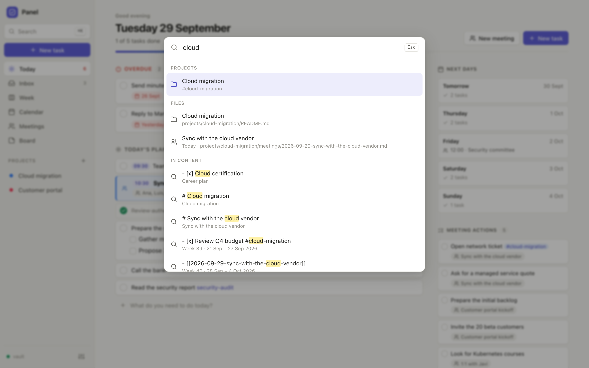

<div align="center">


# Panel

**Tu semana, tus reuniones y tus notas — en archivos Markdown que son tuyos.**

Sin cuentas. Sin nubes en las que tengas que confiar. Sin instalar nada.<br>
Funciona en Windows, macOS, Linux, iPhone y Android.

[**Abrir la app web**](https://jcordon5.github.io/panel/) ·
[Descargar para Windows](https://github.com/jcordon5/panel/releases/latest/download/Panel-Windows.zip) ·
[macOS / Linux](#versión-de-escritorio) ·
[English](README.md)


</div>

---

## ¿Otra app de tareas?

Hay mil apps de tareas y notas. Panel no intenta ganarles en funciones. Existe por unas pocas convicciones:

**Tus datos deben sobrevivir a la app.** Todo lo que escribes en Panel es un archivo `.md` en una carpeta que eliges tú. No hay base
de datos, ni formato propietario, ni “exportar”: abre la carpeta con cualquier editor de texto, Obsidian, VS Code o Git y ahí está todo.
Si Panel desapareciera mañana, no perderías nada.

**Privado por diseño, no por promesa.** Panel no tiene servidores ni cuentas. La app se ejecuta en tu navegador (o como un pequeño
programa local) y lee y escribe tus archivos directamente — en tu disco o en *tu* repositorio privado de GitHub. No hay ninguna empresa
en medio que pueda sufrir una filtración, venderse, cerrar, subir precios o entrenar con tus notas.

**Simple a propósito.** Una semana, un plan del día, reuniones, proyectos y notas. Nada más. Sin bases de datos que diseñar, sin
plugins que configurar, sin 40 vistas que mantener. Lo abres y planificas tu semana; la estructura ya está hecha.

**Funciona donde otras herramientas no están permitidas.** Muchas empresas bloquean herramientas en la nube como Notion y no dejan
instalar apps como Obsidian. Panel funciona en el navegador sobre una carpeta local y nada sale del ordenador — una conversación fácil con
IT. Pon la carpeta en el OneDrive de la empresa y se sincroniza como cualquier otro documento.

**Las reuniones son de primera clase.** La mayoría de apps de tareas tratan las reuniones como algo secundario. En Panel tus reuniones
están *dentro* del plan del día, entre lo que tienes que hacer antes y después; las notas siguen una plantilla; los *próximos pasos* se
convierten en acciones que verás mañana; y tu calendario puede alimentarlo solo.

**Preparado para la IA.** Una bóveda de Markdown estructurado es el idioma nativo de los agentes de IA. Apunta a Claude (o a cualquier
agente) a la carpeta y pregúntale *“¿qué acordamos con el proveedor esta semana?”* o *“planifícame el jueves”*. Una [skill](skills/panel-vault)
lista para usar le enseña el formato.

## ¿Para quién es?

- **Gente con muchas reuniones y varios proyectos** — consultoría, ingeniería, gestión, investigación — que necesita un solo sitio para
  *lo que tengo que hacer* y *lo que se dijo*.
- **Quien planifica por semanas**: suelta tareas en los días, muévelas arrastrando, trae lo atrasado a hoy con un clic.
- **Responsables de equipo** que llevan sus 1:1 y hacen seguimiento de acciones semana a semana.
- **Quien cuida su privacidad**, y quien trabaja en una empresa que no permite apps de notas en la nube.
- **Usuarios de Obsidian** que quieren un planificador sobre su bóveda, y **curiosos de la IA** que quieren que su asistente lea sus notas de trabajo.

## Comparado con…

| | Panel | Notion | Obsidian | App de tareas típica |
| --- | --- | --- | --- | --- |
| Dónde están tus datos | Tu carpeta o tu repo privado | Sus servidores | Tu carpeta | Sus servidores |
| Necesita cuenta | No | Sí | No (la sincronización es de pago) | Sí |
| Archivos legibles en cualquier sitio | ✅ Markdown | ❌ hay que exportar | ✅ Markdown | ❌ |
| Hay que instalar | No (navegador); app de escritorio opcional | No | Sí | Normalmente |
| Semana + reuniones + proyectos de serie | ✅ | Móntatelo tú | Con plugins | Solo tareas |
| Funciona en un PC corporativo restringido | ✅ | A menudo bloqueado | A menudo bloqueado | Depende |
| Móvil | ✅ app web + GitHub | ✅ | ✅ | ✅ |
| Precio | Gratis, código abierto | Freemium | Gratis / sync de pago | Freemium |

Notion es genial para wikis y bases de datos de equipo; Obsidian es una herramienta de conocimiento magnífica con un ecosistema enorme
de plugins. Panel es más pequeño a propósito: un espacio de trabajo diario y semanal rápido, con archivos compatibles con ambos.

## Empezar

### App web — sin instalar nada

Abre **[jcordon5.github.io/panel](https://jcordon5.github.io/panel/)** y elige dónde vive tu bóveda:

- **Una carpeta de tu ordenador** (Chrome, Edge o Brave en el ordenador). Tus archivos no salen del equipo. Usa *Instalar app* en el menú
  del navegador para tener el icono de Panel en el escritorio o el dock.
- **Un repositorio privado de GitHub** — funciona en todos tus dispositivos, **también el móvil**, con el historial de cada cambio. Panel
  te guía para crear el repositorio y un token que solo puede tocar ese repositorio. El token se queda en tu navegador.
- **Probar con datos de ejemplo** — una bóveda de demostración en memoria; no se guarda nada.

### Versión de escritorio

Para Firefox o Safari, para usarlo totalmente sin conexión o para leer automáticamente tu **calendario de Outlook de escritorio**.

- **Windows** — [descarga `Panel-Windows.zip`](https://github.com/jcordon5/panel/releases/latest/download/Panel-Windows.zip), descomprímelo
  y haz doble clic en **`panel.bat`**. Lleva Python incluido: nada más que instalar y sin permisos de administrador.
- **macOS / Linux** — [descarga `panel.zip`](https://github.com/jcordon5/panel/releases/latest/download/panel.zip), descomprímelo y haz doble
  clic en `panel.command` (macOS; la primera vez, clic derecho → *Abrir*) o ejecuta `./panel.sh`. Necesita Python 3.7+ (viene en Linux; en
  macOS el sistema ofrece instalarlo). O en una línea:
  `curl -fsSL https://raw.githubusercontent.com/jcordon5/panel/main/install.sh | sh`

La versión de escritorio se abre en el navegador en `http://127.0.0.1:8765` y deja una ventanita abierta mientras la usas.
`python3 server.py --demo` la arranca con datos de ejemplo.

## Qué incluye

<table>
<tr>
<td></td>
<td></td>
</tr>
<tr>
<td></td>
<td></td>
</tr>
</table>

- **Tablero semanal** — una columna por día más la bandeja. Arrastra tareas entre días y reordénalas; clic para editar; trae lo atrasado a hoy con un clic.
- **Plan del día con las reuniones dentro** — las reuniones van entre tus tareas, en el orden en que ocurren. Arrastra una reunión a otro día para cambiarla de fecha.
- **Hoy** — el día en orden, lo atrasado, los próximos días y las acciones pendientes de tus reuniones recientes.
- **Reuniones** — pulsa <kbd>M</kbd> y empieza a escribir. Plantillas editables (retro, 1:1, entrevista…). Las líneas `- [ ]` son acciones.
- **Proyectos** — resumen, reuniones, tareas (etiquetas `#proyecto` y pendientes de sus documentos) y documentos. Los pausados y terminados siguen a un clic.
- **Calendario** — vista mensual; tus reuniones de Outlook/Google/iCloud aparecen solas (versión de escritorio); un clic crea la nota.
- **Tablón** — notas fijadas y recientes en tarjetas.
- **Markdown de verdad** — tablas, avisos, `[[enlaces]]` con autocompletado, `#etiquetas`, resaltado, código, imágenes (pegar o arrastrar), checkboxes que funcionan.
- **Búsqueda global** (<kbd>Ctrl</kbd>/<kbd>⌘</kbd>+<kbd>K</kbd>), **deshacer cualquier cosa** (<kbd>Ctrl</kbd>/<kbd>⌘</kbd>+<kbd>Z</kbd>), atajos de teclado, modo claro/oscuro, español/inglés.
- **Convive con otras herramientas** — edita los archivos en Obsidian, con un script o con un agente de IA con Panel abierto: lo detecta en segundos y nunca pisa esos cambios.

## Tus datos

- **Sincronizar**: pon la carpeta de la bóveda en OneDrive, Dropbox, iCloud o Syncthing (versión de escritorio o modo carpeta), o usa un repositorio privado de GitHub (web).
- **Exportar**: *Ajustes → Bóveda → Exportar bóveda (.zip)* — todo, en un archivo.
- **Copias de seguridad**: lo borrado va a una carpeta `.trash` dentro de la bóveda. La versión de escritorio además comprime tu bóveda antes
  de cada actualización y se limpia sola (guarda las 5 últimas copias automáticas y las 10 últimas manuales).
- **Actualizaciones**: la app web es siempre la última versión. La de escritorio mira en GitHub al arrancar y se actualiza con un clic — solo
  se sustituye el código; tu bóveda y tus ajustes no se tocan. El formato de la bóveda se mantiene compatible; si algún día evoluciona, Panel
  migra tus archivos de forma segura después de hacer una copia.

## Calendario

*Versión de escritorio → Ajustes → Calendario.* Dos formas; usa la que permita tu organización:

- **Enlace de suscripción al calendario (.ics)** — un solo enlace para *todo* tu calendario (no uno por reunión), que se refresca solo cada pocos
  minutos. Funciona con cualquier sistema: Outlook web (*Configuración → Calendario → Calendarios compartidos → Publicar un calendario → enlace ICS*),
  Google Calendar (*Configuración → tu calendario → Dirección secreta en formato iCal*), iCloud, Nextcloud…
- **Outlook de escritorio (Windows)** — lee directamente el Outlook instalado en tu PC, para empresas que desactivan la publicación de calendarios.

Las reuniones aparecen en *Hoy*, *Semana* y *Calendario*; un clic en una y Panel crea su nota (título, hora, asistentes, lugar) en tu plan del
día. Los calendarios solo se leen, nunca se modifican. Los navegadores no dejan que una web lea calendarios de otros sitios, por eso esto va en la versión de escritorio.

## La bóveda

```
vault/
├── README.md                         cómo se organiza la bóveda (para personas e IAs)
├── inbox.md                          tareas sin fecha (Bandeja)
├── weeks/2026-W40.md                 un archivo por semana ISO, una sección "## " por día
├── meetings/2026-09-29-sync.md       reuniones que no son de ningún proyecto
├── projects/<proyecto>/README.md     ficha del proyecto
├── projects/<proyecto>/meetings/…    reuniones del proyecto
├── projects/<proyecto>/*.md          otros documentos del proyecto
├── notes/*.md                        notas generales (el Tablón)
├── templates/meeting.md …            plantillas personalizables
└── assets/2026-09/…                  imágenes pegadas
```

Un archivo de semana es Markdown sin más:

```markdown
---
type: week
week: 2026-W40
start: 2026-09-28
---

# Semana 40 · 28 sep – 4 oct 2026

## Martes · 2026-09-29

- [ ] 09:30 Daily del equipo
- [ ] Preparar la demo                  ← antes de la reunión
- [[2026-09-29-sync-con-el-proveedor]]  ← la reunión, donde ocurre
- [ ] Enviar el acta #migracion-cloud
  - el detalle va indentado bajo su tarea
```

Convenciones: cabecera YAML (`type`, `title`, `date`, `time`, `project`, `attendees`, `tags`, `created`, `updated`; las claves desconocidas se
respetan) · tareas `- [ ]` / `- [x]` · una hora `HH:MM` al principio es la hora de la tarea · `#carpeta-del-proyecto` asocia la tarea a un
proyecto · lo que cuenta es la fecha ISO del título del día · plantillas en `templates/` (`meeting.md` por defecto, `meeting-<nombre>.md`
alternativas) con `{{title}}`, `{{date}}`, `{{time}}`, `{{project}}`, `{{attendees}}`, `{{today}}`. 100 % compatible con Obsidian.

**¿Vienes de Panel v1 (`boveda/`)?** Pon tu carpeta `boveda` junto a `server.py` de la versión de escritorio antes de arrancarla la primera vez
y Panel te ofrece migrarla (la original no se toca), o ejecuta `python3 tools/migrate_v1.py ruta/a/boveda ruta/a/vault es`.

## Para agentes de IA

[`skills/panel-vault`](skills/panel-vault) es una skill para Claude (y una guía para cualquier agente) con un pequeño script, `panel_vault.py`
(solo librería estándar), para leer el día o la semana, listar reuniones y acciones pendientes, ver el estado de un proyecto, y añadir, completar
o mover tareas y crear reuniones igual que la app.

- Claude Code: copia la carpeta a `~/.claude/skills/panel-vault` (o a `.claude/skills/` en un proyecto).
- Apps de Claude: comprime la carpeta en un zip y añádela en *Ajustes → Capacidades → Skills*.
- Otros agentes: apúntales a `skills/panel-vault/SKILL.md`.

## Privacidad y seguridad

- Sin servidores, cuentas, analítica ni rastreo. La app web son archivos estáticos; tu bóveda va directamente de tu navegador a tu disco o a `api.github.com`.
- El servidor de escritorio solo escucha en `127.0.0.1`, rechaza peticiones de otras webs y solo puede tocar archivos dentro de la bóveda.
- El Markdown se sanea (sin HTML crudo ni enlaces `javascript:`) y se aplica una política de seguridad de contenido estricta.
- Las únicas conexiones externas son las que tú configuras: tu repositorio de GitHub, tus calendarios y la comprobación de actualizaciones.

## Desarrollo

Sin compilación y sin dependencias: HTML/CSS/módulos ES en `app/` (esos mismos archivos son la app web), `server.py` para la versión de
escritorio (solo librería estándar) y [marked](https://github.com/markedjs/marked) incluido.

```bash
python3 server.py --demo   # versión de escritorio con datos de ejemplo
npm test                   # node --test tests/*.test.js && python3 -m unittest discover -s tests
```

Las contribuciones son bienvenidas, sobre todo traducciones (`app/js/strings.js`).

## Licencia

[MIT](LICENSE) — libre para usar, modificar y compartir.
