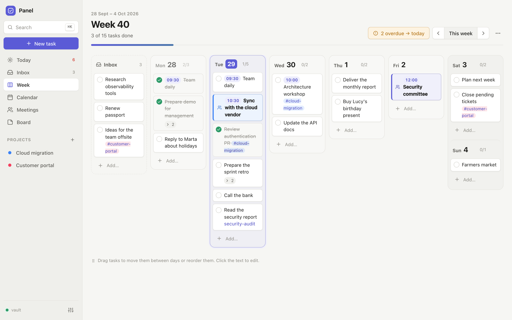
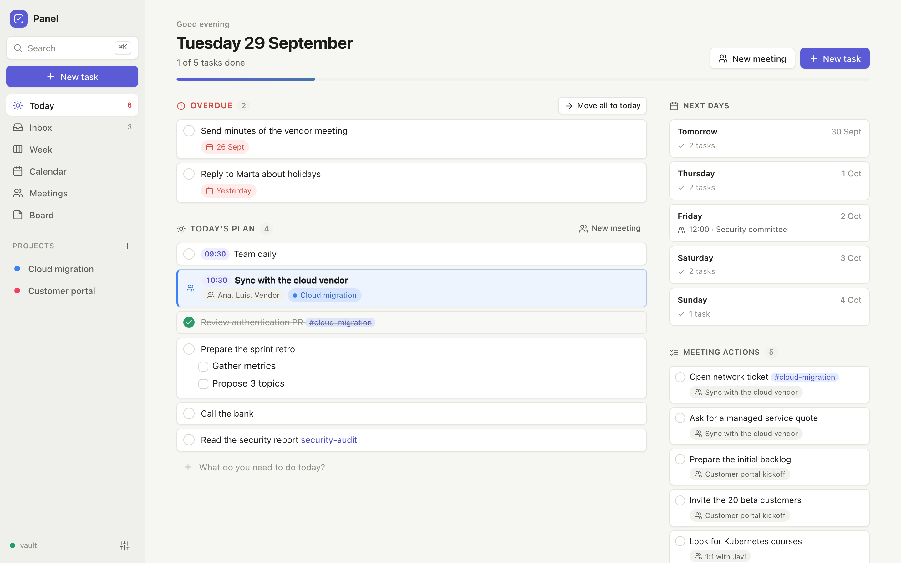
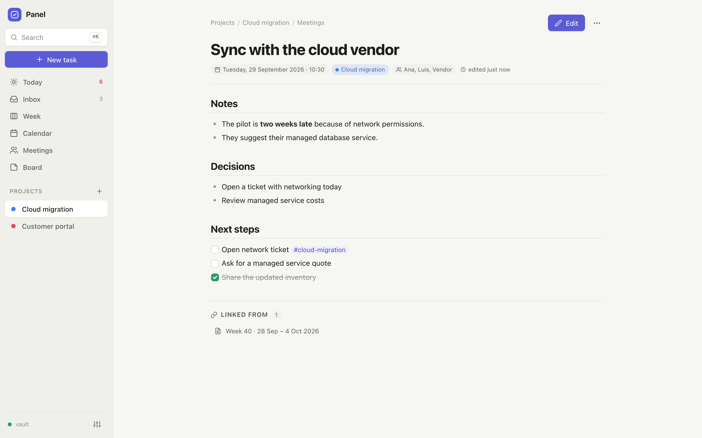
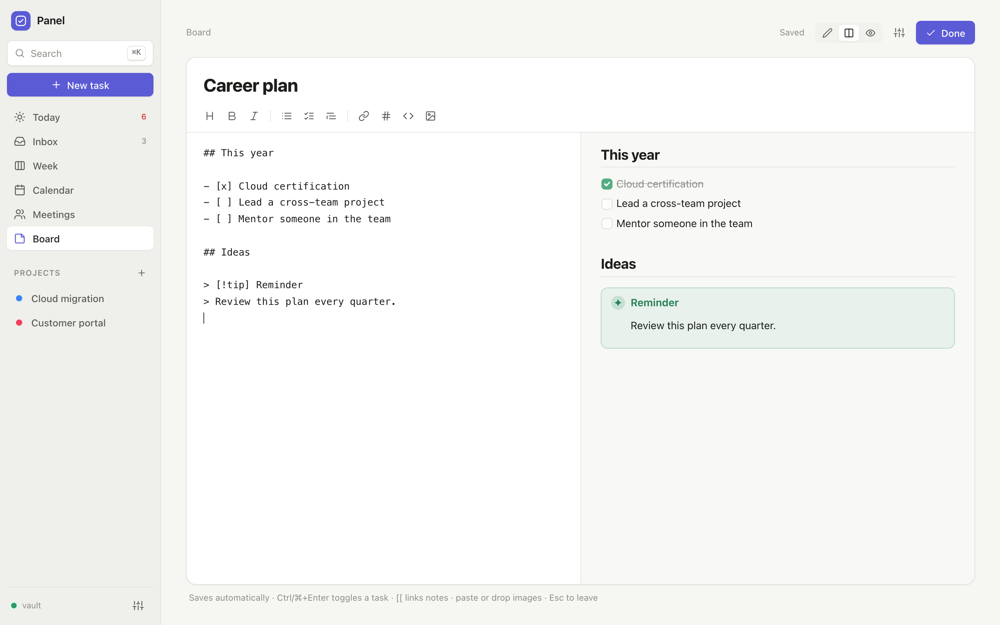
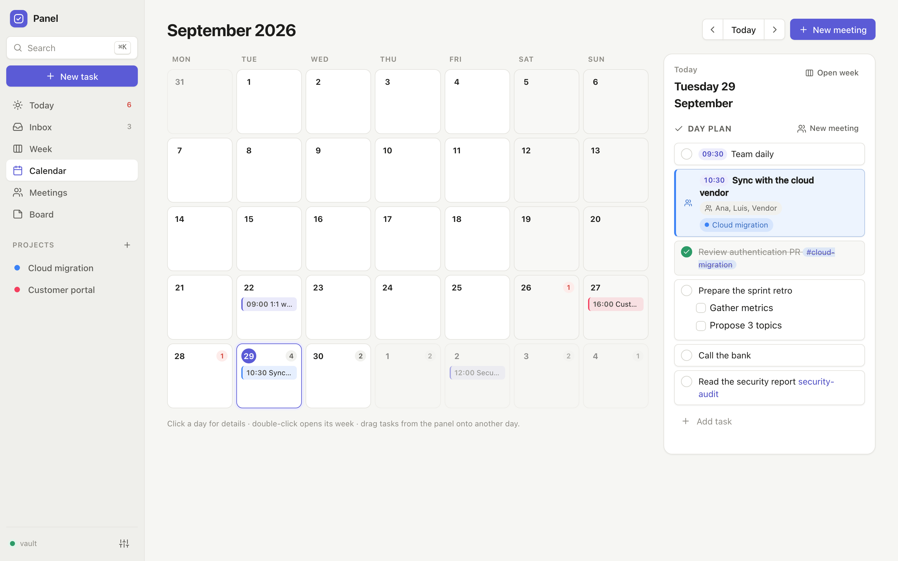
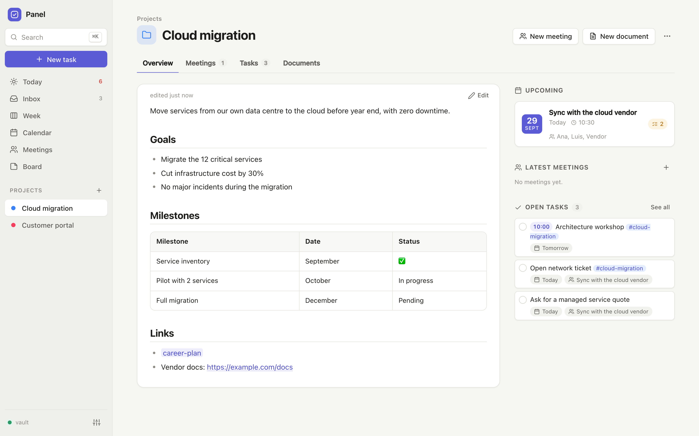
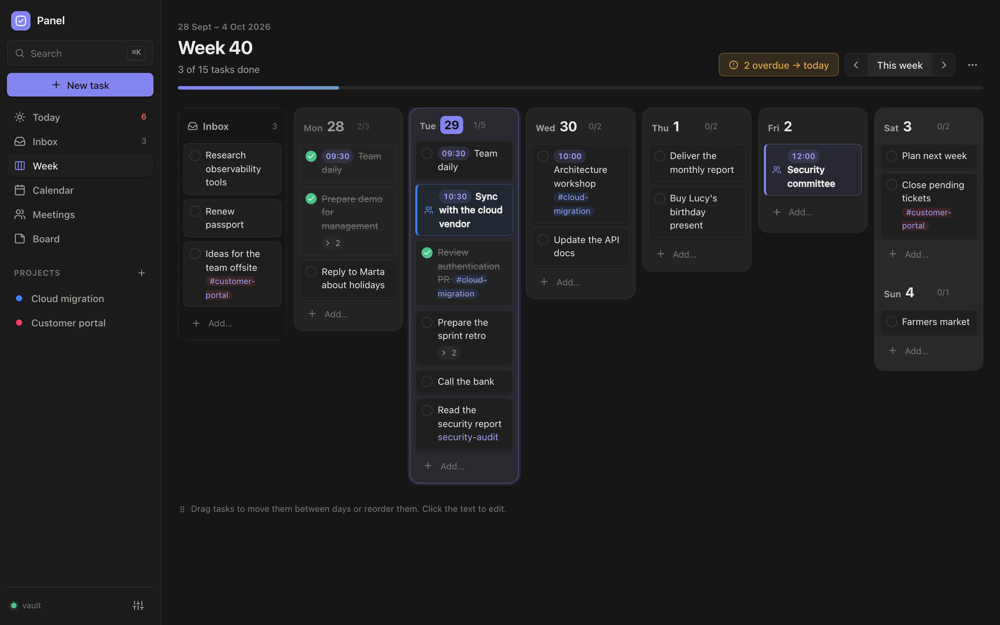

<div align="center">


# Panel

**Your week, your meetings and your notes — in plain Markdown files that belong to you.**

No account. No cloud you have to trust. No install required.<br>
Works on Windows, macOS, Linux, iPhone and Android.

[**Open the web app**](https://jcordon5.github.io/panel/) ·
[Download for Windows](https://github.com/jcordon5/panel/releases/latest/download/Panel-Windows.zip) ·
[macOS / Linux](#desktop-version) ·
[Español](README.es.md)



</div>

---

## Why another task app?

There are a thousand task and note apps. Panel doesn't try to out-feature them. It exists because of a few convictions:

**Your data should outlive the app.** Everything you write in Panel is a `.md` file in a folder you choose. There is no database, no
proprietary format and no export step: open the folder with any text editor, Obsidian, VS Code or Git and it's all there. If Panel
disappeared tomorrow you would lose nothing.

**Private by architecture, not by promise.** Panel has no servers and no accounts. The app runs in your browser (or as a tiny local
program) and reads and writes your files directly — on your disk or in *your* private GitHub repository. There is no company in the
middle that can be breached, sold, shut down, raise prices or train on your notes.

**Simple on purpose.** A week, a day plan, meetings, projects and notes. That's it. No databases to design, no plugins to
configure, no 40 views to maintain. You open it and plan your week; the structure is already there.

**It works where other tools are not allowed.** Many companies block cloud tools like Notion and don't let you install apps like
Obsidian. Panel runs in the browser on a local folder and nothing leaves the computer — an easy conversation with IT. Put the folder
in your corporate OneDrive and it syncs like any other document.

**Meetings are first-class.** Most task apps treat meetings as an afterthought. In Panel your meetings sit *inside* your day plan,
between the things to do before and after them; notes follow a template; *next steps* become action items you'll see tomorrow; and
your calendar can feed it automatically.

**Ready for AI.** A structured Markdown vault is the native language of AI agents. Point Claude (or any agent) at the folder and ask
*“what did we decide with the vendor this week?”* or *“plan my Thursday”*. A ready-made [skill](skills/panel-vault) teaches agents the format.

## Who is it for?

- **People with many meetings and several projects** — consultants, engineers, managers, researchers — who need one place for
  *what I have to do* and *what was said*.
- **Anyone who plans by the week**: drop tasks on days, drag them around, bring overdue work to today with one click.
- **Team leads** keeping 1:1 notes and following up on action items across weeks.
- **Privacy-conscious people**, and anyone whose company won't allow cloud note apps.
- **Obsidian users** who want a planner on top of their vault, and **AI tinkerers** who want their assistant to read their work notes.

## How it compares

| | Panel | Notion | Obsidian | Typical to-do app |
| --- | --- | --- | --- | --- |
| Where your data lives | Your folder or your private repo | Their servers | Your folder | Their servers |
| Account needed | No | Yes | No (sync is paid) | Yes |
| Plain files you can read anywhere | ✅ Markdown | ❌ export needed | ✅ Markdown | ❌ |
| Install needed | No (browser); optional desktop app | No | Yes | Usually |
| Week planning + meetings + projects out of the box | ✅ | Build it yourself | With plugins | Tasks only |
| Works on a locked-down work PC | ✅ | Often blocked | Often blocked | Varies |
| Phone | ✅ web app + GitHub | ✅ | ✅ | ✅ |
| Price | Free, open source | Freemium | Free / paid sync | Freemium |

Notion is great for team wikis and databases; Obsidian is a superb knowledge tool with a huge plugin ecosystem. Panel is deliberately
smaller: a fast daily/weekly workspace that keeps your files compatible with both.

## Get started

### Web app — nothing to install

Open **[jcordon5.github.io/panel](https://jcordon5.github.io/panel/)** and choose where your vault lives:

- **A folder on this computer** (Chrome, Edge or Brave on desktop). Your files never leave the machine. Use *Install app* in the browser
  menu to get a Panel icon on your desktop or dock.
- **A private GitHub repository** — works on every device, **your phone included**, with the full history of every change. Panel walks
  you through creating the repository and a token that can only touch that repository. The token stays in your browser.
- **Try it with sample data** — a demo vault in memory; nothing is saved.

### Desktop version

For Firefox/Safari, fully offline use, or to read your **Outlook desktop calendar** automatically.

- **Windows** — [download `Panel-Windows.zip`](https://github.com/jcordon5/panel/releases/latest/download/Panel-Windows.zip), unzip it
  and double-click **`panel.bat`**. Python is included: nothing else to install, no admin rights.
- **macOS / Linux** — [download `panel.zip`](https://github.com/jcordon5/panel/releases/latest/download/panel.zip), unzip and double-click
  `panel.command` (macOS; the first time, right-click → *Open*) or run `./panel.sh`. Needs Python 3.7+ (built into Linux; on macOS the
  system offers to install it). Or in one line:
  `curl -fsSL https://raw.githubusercontent.com/jcordon5/panel/main/install.sh | sh`

The desktop version opens in your browser at `http://127.0.0.1:8765` and keeps a small window open while it runs.
`python3 server.py --demo` starts it with sample data.

## What you get

<table>
<tr>
<td></td>
<td></td>
</tr>
<tr>
<td></td>
<td></td>
</tr>
<tr>
<td></td>
<td></td>
</tr>
</table>

- **Week board** — one column per day plus your inbox. Drag tasks between days and reorder them; click to edit; bring overdue tasks to today in one click.
- **Day plan with meetings in it** — meetings sit among your tasks, in the order things happen. Drag a meeting to another day to reschedule it.
- **Today** — the day in order, overdue work, upcoming days and open action items from recent meetings.
- **Meetings** — press <kbd>M</kbd> and start writing. Editable templates (retro, 1:1, interview…). `- [ ]` lines become action items.
- **Projects** — overview, meetings, tasks (`#project` tags plus open items in its documents) and documents. Paused and done projects stay one click away.
- **Calendar** — month view; your Outlook/Google/iCloud meetings appear on their own (desktop version); one click creates the note.
- **Notes board** — pinned and recent notes as cards.
- **Real Markdown** — tables, callouts, `[[links]]` with autocomplete, `#tags`, highlights, code, images (paste or drop), interactive checkboxes.
- **Search everything** (<kbd>Ctrl</kbd>/<kbd>⌘</kbd>+<kbd>K</kbd>), **undo anything** (<kbd>Ctrl</kbd>/<kbd>⌘</kbd>+<kbd>Z</kbd>), keyboard shortcuts, light/dark, English/Spanish.
- **Plays well with others** — edit the files in Obsidian, a script or with an AI agent while Panel is open: it notices within seconds and never overwrites those changes.

## Your data

- **Sync**: put the vault folder in OneDrive, Dropbox, iCloud or Syncthing (desktop version or folder mode), or use a private GitHub repository (web).
- **Export**: *Settings → Vault → Export vault (.zip)* — everything, in one file.
- **Backups**: deletes go to a `.trash` folder inside the vault. The desktop version also zips your vault before every update and
  cleans up after itself (it keeps the last 5 automatic and 10 manual backups).
- **Updates**: the web app is always the latest version. The desktop version checks GitHub when it starts and updates with one click —
  only the app code is replaced; your vault and settings are never touched. The vault format stays backwards compatible; if it ever
  evolves, Panel migrates your files safely after making a backup.

## Calendar

*Desktop version → Settings → Calendar.* Two ways; use whichever your organisation allows:

- **Calendar subscription link (.ics)** — one link for your *whole* calendar (not one per meeting), refreshed automatically every few
  minutes. Works with any system: Outlook on the web (*Settings → Calendar → Shared calendars → Publish a calendar → ICS link*),
  Google Calendar (*Settings → your calendar → Secret address in iCal format*), iCloud, Nextcloud…
- **Outlook desktop (Windows)** — reads the Outlook app installed on your PC directly, for companies that disable calendar publishing.

Meetings then appear in *Today*, *Week* and *Calendar*; click one and Panel creates its note (title, time, attendees, place) in your day
plan. Calendars are only read, never changed. Browsers don't let a web page read other sites' calendars, so this lives in the desktop version.

## The vault

```
vault/
├── README.md                         how the vault is organised (for humans and AIs)
├── inbox.md                          tasks without a date
├── weeks/2026-W40.md                 one file per ISO week, one "## " section per day
├── meetings/2026-09-29-sync.md       meetings that belong to no project
├── projects/<project>/README.md      project overview
├── projects/<project>/meetings/…     project meetings
├── projects/<project>/*.md           other project documents
├── notes/*.md                        general notes (the Board)
├── templates/meeting.md …            templates you can customise
└── assets/2026-09/…                  pasted images
```

A week file is just Markdown:

```markdown
---
type: week
week: 2026-W40
start: 2026-09-28
---

# Week 40 · 28 Sep – 4 Oct 2026

## Tuesday · 2026-09-29

- [ ] 09:30 Team daily
- [ ] Prepare the demo              ← before the meeting
- [[2026-09-29-sync-with-vendor]]   ← the meeting, where it happens
- [ ] Send the minutes #cloud-migration
  - details are indented under their task
```

Conventions: YAML frontmatter (`type`, `title`, `date`, `time`, `project`, `attendees`, `tags`, `created`, `updated`; unknown keys are
kept) · tasks are `- [ ]` / `- [x]` · a leading `HH:MM` is the task time · `#project-folder` links a task to a project · the ISO date
in the day heading is what counts · templates in `templates/` (`meeting.md` is the default, `meeting-<name>.md` are alternatives) use
`{{title}}`, `{{date}}`, `{{time}}`, `{{project}}`, `{{attendees}}`, `{{today}}`. Fully compatible with Obsidian.

**Coming from Panel v1 (`boveda/`)?** Put your `boveda` folder next to `server.py` of the desktop version before the first start and
Panel offers to migrate it (the original is never modified), or run `python3 tools/migrate_v1.py path/to/boveda path/to/vault es`.

## For AI agents

[`skills/panel-vault`](skills/panel-vault) is a skill for Claude (and a guide for any agent) plus a small script, `panel_vault.py`
(standard library only), to read the day or week, list meetings and action items, get a project status, and add, complete or move
tasks and create meetings exactly like the app does.

- Claude Code: copy the folder to `~/.claude/skills/panel-vault` (or `.claude/skills/` in a project).
- Claude apps: zip the folder and add it in *Settings → Capabilities → Skills*.
- Other agents: point them to `skills/panel-vault/SKILL.md`.

## Privacy & security

- No servers, accounts, analytics or tracking. The web app is static files; your vault goes straight from your browser to your disk or to `api.github.com`.
- The desktop server only listens on `127.0.0.1`, rejects requests from other websites and can only touch files inside the vault.
- Rendered Markdown is sanitised (no raw HTML, no `javascript:` links) and a strict Content Security Policy is applied.
- The only outbound requests are the ones you configure: your GitHub repository, your calendar links and the update check.

## Development

No build step and no dependencies: plain HTML/CSS/ES modules in `app/` (the same files are the web app), `server.py` for the desktop
version (standard library only), [marked](https://github.com/markedjs/marked) vendored.

```bash
python3 server.py --demo   # desktop version with sample data
npm test                   # node --test tests/*.test.js && python3 -m unittest discover -s tests
```

```
app/js/backends.js   where the vault lives: local server, browser folder, GitHub repository, demo
app/js/store.js      file cache, conflict-safe writes, undo, live reload
app/js/model.js      parses the vault: docs, projects, weeks, tasks
app/js/ops.js        pure text operations on Markdown
app/js/views/        one module per screen
server.py            desktop server (API, calendar, updates)
tools/               calendar reader, updater, v1 migration, demo generator
```

Contributions are welcome — especially translations (`app/js/strings.js`).

## License

[MIT](LICENSE) — free to use, change and share.
